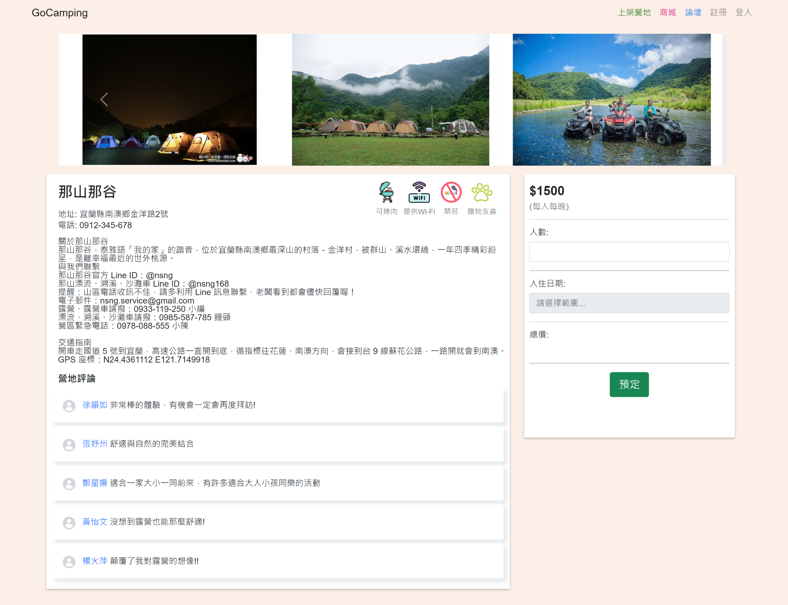

# TFA103G4 Final Project - Campsite Web

## Overview

The Campsite Web project aims to develop a comprehensive platform for camping enthusiasts. It provides detailed information on various campsites registered by providers, facilitates the buying and selling of camping equipment, and offers real-time communication between consumers and providers. This centralized platform significantly reduces the time consumers spend searching for information across multiple sources.

**Modules in Focus:** `campsite`, `campsitetentstatus`

## Module Details

### Campsite Module

The `campsite` module manages essential information about camping sites.

**Features:**
- Comprehensive display of campsite details: name, address, photos, descriptions, facility rules, reviews, and pricing
- Google Maps API integration for visual location representation
- Full CRUD operations for campsite data management
- Advanced search functionality (by name, address, and price range)

### CampsiteTentStatus Module

The `campsitetentstatus` module oversees the availability and status of tents at camping sites.

**Features:**
- Real-time display of business hours and remaining capacity for each campsite
- CRUD operations for tent data management
- Sophisticated search capabilities (by date range and group size)

## User Interface Previews

### Home Page

### Campsite Search

### Campsite Details

## Project Demonstration

For a comprehensive overview of the project's functionality, please watch our [introduction video](https://youtu.be/WwXtrShLg-k).

## Technology Stack

